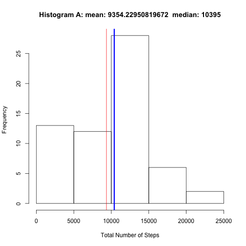
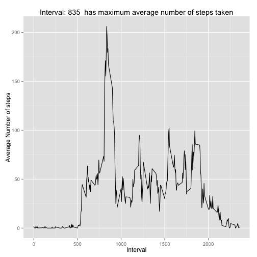
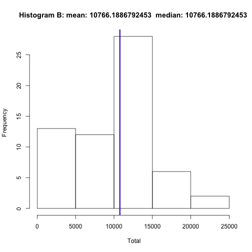
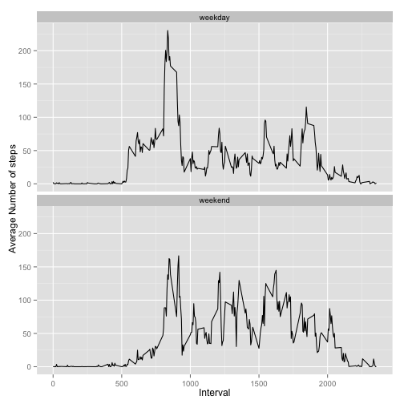

## Loading and preprocessing the data
I load dataset Activity monitoring data (file name: activity.csv) include in zip file (activity.zip). 

 * The variables included in the dataset are:  
    + steps:Number of steps taking in a 5-minute interval (NA denotes for missing value)  
    + date: The date on which the measurement was taken in YYYY-MM-DD format  
    + intverval: identifier for the 5-minute interval in which measurement was taken  
It has 17,568 observations in this dataset. 


```r
## load activity data
activityDf <- read.csv("activity.csv")
dim(activityDf)
```

```
## [1] 17568     3
```

```r
head(activityDf)
```

```
##   steps       date interval
## 1    NA 2012-10-01        0
## 2    NA 2012-10-01        5
## 3    NA 2012-10-01       10
## 4    NA 2012-10-01       15
## 5    NA 2012-10-01       20
## 6    NA 2012-10-01       25
```
## What is mean total number of steps taken per day?
I group dataset by day (dataset variable:dates) to generate a new dataset (by_date)  
I summarise the total number of steps taken by date and generated new dataset (stepsDate)  

 * The variables included in the dataset are:  
    + date: The date on which the measurement was taken in YYYY-MM-DD format  
    + Total: The total number of steps taken per date 
dataset stepsDate is used to calculate the mean and median of the total number of steps taken per day  
NOTE: All missing values are ingnored when calculate total, mean and median of total number of steps taken per day  


```r
## group by date 
by_date <- group_by(activityDf,date) 
## ignore missing values (NA) when calculate Total, mean and median
stepsDate<- summarise(by_date,total = sum(steps, na.rm=TRUE))
head(stepsDate)
```

```
## Source: local data frame [6 x 2]
## 
##         date total
## 1 2012-10-01     0
## 2 2012-10-02   126
## 3 2012-10-03 11352
## 4 2012-10-04 12116
## 5 2012-10-05 13294
## 6 2012-10-06 15420
```

```r
m <- mean(stepsDate$total,na.rm=TRUE)
med <- median(stepsDate$total,na.rm=TRUE)
```
We generated a histogram plot (Histogram A) to show the visualize distribution of the total number of steps taken per day of the data set  

 * The mean and median values are displayed in the title.    
    + Red line: The mean of the total number of steps taken per day
    + Blue line: The median of the total number of steps taken per day


```r
## generate histogram of the total number of steps taken each day
x <- stepsDate$total
hist(x, xlab="Total Number of Steps",main=paste("Histogram A: mean:",m," median:",med))
abline(v = median(stepsDate$total), col = "blue", lwd = 3)
abline(v = mean(stepsDate$total), col = "red", lwd = 1)
```

 

## What is the average daily activity pattern?
I group dataset by interval (dataset variable:interval) to generate a new dataset (by_interval)  
I summarise the total number of steps taken by date and generated new dataset (stepsInt)

 * The variables included in the dataset are:   
    + interval: identifier for the 5-minute interval in which measurement was taken   
It marks the 24 hours by 5-interval identifier. (from 0 = 12 am to 2355 = 11:55 pm )  
    + mean: The average number of steps taken, averaged across all days at that interval identifier.   

It is difficult to pinpoint which interval has the maximum number of average number of steps taken by graph so I show it at title.  


```r
## Group by interval
by_interval <- group_by(activityDf,interval) 
stepsInt<- summarise(by_interval,mean = mean(steps, na.rm=TRUE))
head(stepsInt)
```

```
## Source: local data frame [6 x 2]
## 
##   interval      mean
## 1        0 1.7169811
## 2        5 0.3396226
## 3       10 0.1320755
## 4       15 0.1509434
## 5       20 0.0754717
## 6       25 2.0943396
```

```r
maxMean <- round(max(stepsInt$mean))
maxInt <- stepsInt[round(stepsInt$mean)==maxMean,][1]
## Generate time series plot to show the average daily activity pattern
ggplot(stepsInt, aes(x=stepsInt$interval, y=stepsInt$mean)) + 
    geom_line() +
    labs(x = "Interval", y = "Average Number of steps", title=paste("Interval:",maxInt," has maximum average number of steps taken"))
```

 

## Imputing missing values
I calculated how many missing values by column name in activity dataset

```r
## Calculate the missing rows 
colSums(is.na(activityDf))
```

```
##    steps     date interval 
##     2304        0        0
```
I cloned a new dataset (actNewDF) from activity dataset. My strategy for filling in all missing data in steps column with the mean of average steps taken for that 5-minute internval (function getIntMean) using data in stepsInt data set. 


```r
## create new dataframe: actNewDf
actNewDf <- data.frame(steps =activityDf$steps,date = activityDf$date,interval = activityDf$interval)
## get interval mean 
getIntMean <- function(x) {
    return(stepsInt[stepsInt$interval==x,][[2]])
}
## Fill NA with interval mean
for(i in 1:length(actNewDf$steps)){
    if(is.na(actNewDf$steps[i])){
        actNewDf$steps[i] <- getIntMean(actNewDf$interval[i])
    }
}
```

Repeat section "What is mean total number of steps taken per day" procedure to generate histogram with mean and median information.   
We generated a histogram plot (Histogram B) to show the visualize distribution of the total number of steps taken per day of the data set  

 * The mean and median values are displayed in the title.    
    + Red line: The mean of the total number of steps taken per day
    + Blue line: The median of the total number of steps taken per day

The visualize distribution of two historgrams Histogram A (ignore missing data), Historgram B ( imputing missing data) are almost identical.   

 * There are two impacts for imputing missing value.  
    + The value of mean and median are the same for imputing missing dataset.  
    + The mean and median of imputing missing dataset are larger than the ignore missing value dataset.   


```r
## Generate Histogram
## Calculate mean total number of steps taken per day
by_Newdate <- group_by(actNewDf,date) 

stepsNewDate<- summarise(by_Newdate,total = sum(steps))
## generate histogram of the total number of steps taken each day
m2 <- mean(stepsNewDate$total)
med2 <- median(stepsNewDate$total)
x <- stepsDate$total
hist(x, xlab=" Total",main=paste("Histogram B: mean:",m2," median:",med2))
abline(v = median(stepsNewDate$total), col = "blue", lwd = 3)
abline(v = mean(stepsNewDate$total), col = "red", lwd = 1)
```

 

## Are there differences in activity patterns between weekdays and weekends?

I generated two the time series plots one for weekday activity and one for weekend. It is more active in the morning during weekday and more average distributed during daytime in the weekend.


```r
## Create weekend variable
wkend <- c("Saturday","Sunday")
actNewDf$day = ifelse(weekdays(as.Date(actNewDf$date)) %in% wkend, "1","0")
## convert to factor class
actNewDf$day <- factor(actNewDf$day,labels=c("weekday","weekend"))
## Generate time series plots by weekdays and weekend to show activity pattern
by_dayInt <- group_by(actNewDf,day,interval)
##stepsDayInt<- summarise(by_dayInt,mean = mean(steps, na.rm=TRUE))
stepsDayInt<- summarise(by_dayInt,mean = mean(steps))
ggplot(stepsDayInt, aes(x=interval, y=mean)) + 
    geom_line() +
    labs(x = "Interval", y = "Average Number of steps")+
    facet_wrap(~day, nrow=2)
```

 
